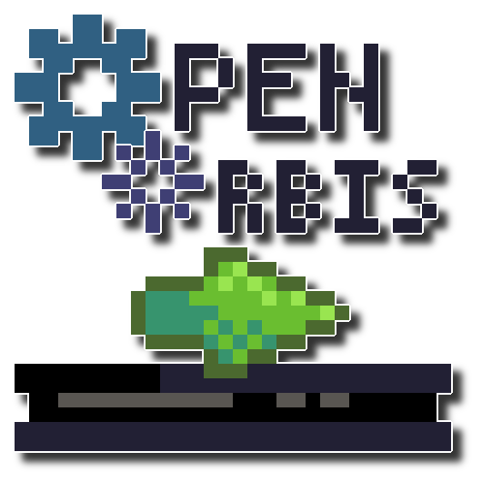

# OpenOrbis PS4 Toolchain

[](https://github.com/OpenOrbis/OpenOrbis-PS4-Toolchain) [](https://github.com/OpenOrbis/OpenOrbis-PS4-Toolchain) [](https://github.com/OpenOrbis/OpenOrbis-PS4-Toolchain/blob/master/LICENSE)

[](https://github.com/OpenOrbis/OpenOrbis-PS4-Toolchain/releases/latest) [](https://github.com/OpenOrbis/OpenOrbis-PS4-Toolchain/releases/latest) [](https://github.com/OpenOrbis/OpenOrbis-PS4-Toolchain/releases/latest)

**Note: Use the release zip or an installer, or you'll have to build the libraries and binaries yourself. It's setup this way to prevent the repo from getting bloated with binaries.**

This repository contains the source code and documentation for the OpenOrbis PS4 toolchain, which enables developers to build homebrew without the need of Sony's official Software Development Kit (SDK). It contains the header files, library stubs, and tools to build applications and libraries for the PS4.

The header files as well as the library stubs may need updating to support yet undiscovered functions, so feel free to fork the repository and make pull requests to update support.

<p align="center">
	
</p>

## Notes

The following projects will be added to this repo soon:
- Debugger
- MiraLib

It was intended for these to drop at the same time as everything else, however both are getting ported to .NET core to be made more future-proof and to allow easier Continuous Integration (CI).

## Documentation

Each tool will have an additional `README.md` file in it's sub-directory giving more specific information on that project. The `docs` sub-directory also contains additional materials and documentation. Below is an overview of the purpose of each sub-directory:

| Directory | Contents |
|--|--|
| `/bin` | Executables for tools for each platform (Windows in `/bin/windows`, Linux in `/bin/linux` and macOS in `/bin/macos`) |
| `/docs` | Documentation for PS4 format specifications (reverse engineered) and the toolchain itself
| `/extra` | Extra / miscellaneous files. Currently, this includes project templates for Visual Studio
| `/include` | Contains header files to compile against when building applications/libraries (PS4 specific files are in `/include/orbis`
| `/lib` | Contains library stubs to link against when building applications/libraries
| `/samples` | Example programs to get you started and for reference
| `/scripts` | Helpful scripts to view Orbis ELF (OELF) information as well as other various tools
| `/src` | Contains source code for tools (see [/src/README.md](/src/README.md) for more information on this directory)


## Setup & Installation

The clang toolchain as well as the llvm linker (lld) is needed to compile and link using this SDK. For Windows, these can be downloaded using the [Pre-Built Binaries](https://releases.llvm.org/download.html) provided by LLVM. For Linux and macOS, the same page contains pre-built binaries, however you can also use the following commands (Debian/Ubuntu):

```
sudo apt-get update
sudo apt-get install clang
sudo apt-get install lld
```
In case you're using any Arch derivative:

```
sudo pacman -S clang
sudo pacman -S lld
```

macOS users can use [Homebrew](https://brew.sh/) to install a pure copy of LLVM (the Apple version would not work with the toolchain!)

```
brew install llvm
```

In the future, we may include pre-built binaries for clang/lld, however for the present, it is required for you to install these separately.

The `OO_PS4_TOOLCHAIN` environment variable also needs to be set. On Windows, this can be done using the environment variables control panel. On linux and macOS, the following command can be added to `~/.bashrc` (Debian/Ubuntu), `~/.bash_profile` (macOS Mojave and lower) or `~/.zshrc` (macOS Catalina):

```
export OO_PS4_TOOLCHAIN=[directory of installation]
```

This is needed so the build scripts and the converter tool know where to look for certain files. It is also recommended you add the root SDK directory + `/bin` to your path variable.

### Windows Installer
For Windows, a Nullsoft scriptable installer is provided, which will automate the process of extracting the toolchain files and setting the `OO_PS4_TOOLCHAIN` environment variable.

### Linux
For Linux, after installing the required dependencies and setting up the environment variable as noted above, you'll also want to run the `setup-toolchain.sh` script in `/extra`. This will mark all the Linux binaries as executable, as by default they're read/write.

### macOS
For macOS, a PKG installer is provided, which will automate the process of extracting the toolchain files and setting the `OO_PS4_TOOLCHAIN` environment variable in both bash and zsh shells.

## Creating Homebrew Projects

For Windows, `/extra` provides Visual Studio templates which can be added into your VS installation's templates directory to allow easy creation of homebrew projects. You can also copy and modify the solutions from the provided samples.

For Linux and macOS, `/extra` contains a `setup-project.sh` script which will create a project directory based on the `hello_world` sample.

## Contribution

Contribution is welcome, the OpenOrbis toolchain is open source after all. For those eager to contribute, we have an actively maintained list of issues on [CONTRIBUTING.md](/CONTRIBUTING.md) that are accessible and would be awesome to get closed. We appreciate anyone who contributes and acknowledgements will be maintained in this README.

## Tools

Each tool will have a dedicated `README.md` file for more specific information on the tool. Below is a generic overview of the tools included in the toolchain currently.

### create-eboot

The `create-eboot` tool takes normal Executable Linkable Format (ELF) files and performs the necessary patches and relinking to create an Orbis ELF (OELF). It will further take this OELF and process it into a final wrapped Signed Executable Linkable Format (SELF). This was made possible thanks to flatz' previous work on the `make-fself.py` script, which can be found in `/scripts`. For more information on these formats, see the wiki or `/docs`.

Author: Specter + flatz (fself stuff)

### create-lib
The `create-lib` tool is similar to the `create-eboot` tool, however it produces Playstation Relocatable eXecutable (PRX) library files from a given ELF file.

Author: Specter + flatz (fself stuff)

### create-gp4
The `create-gp4` tool generates .GP4 project files for package (pkg) generation.

Author: Specter + John Tornblom (wrote python prototype the tool is based on)

### liborbispkg
The `liborbispkg` tool takes a set of files that applications are expected to have (`eboot.bin`, `param.sfo`, necessary modules, etc.) and creates a package file (pkg) for them to install on the PS4.

Author: maxton

### stub-generator
The `stub-generator` generates the header files and shared libraries (.so) files for linking with PS4 system libraries. The output of this tool can be found in `/include/orbis` and `/lib`. These directories are essential to properly link with PS4 libraries.

Author: CrazyVoid

### miralib
The `miralib` library contains C# and Python code for interacting with Mira on the desktop side of things. This includes management of a local list of consoles, connecting to a console, and performing various actions once connected via RPC.

Author: Specter + Kiwi

### assistant
Assistant is actually a suite of tools for aiding in developing PS4 homebrew. This includes a log viewer, a debugger, a launcher for Mira, and a tray application to easily launch all of these.

Author: Specter

### readelf replacement
A replacement `readelf` tool for reading PS4-compatible ELFs, otherwise known as Orbis ELFs (OELF).

Author: Specter

## Scripts

All scripts in the `/scripts` directory are Python 3 scripts, specifically targeting Python 3.7.0, with the exception of `/scripts/make_fself.py`. You will need Python installed on your system to run these scripts. Usage of these scripts can be found in [/scripts/README.md](/scripts/README.md).

**autobuild.py** - is an automated pkg generating script based on project dir content (may be unstable, wait for release build)

**dynamic_entries.py** - Gets a list of dynamic entries from the dynamic table of Orbis ELFs.

**make_fself.py** - Copy of flatz' script to generate fake SELF files. This functionality has now been integrated as a part of `create-eboot` and `create-lib`.

**program_headers.py** - Gets a list of program headers from the program header table of Orbis ELFs.

**rela_entries.py** - Gets a list of relocation with addend (RELA) entries from the relocation table of Orbis ELFs.

**symbol_entries.py** - Gets a list of symbols from the symbol table of Orbis ELFs.


## License

[OpenOrbis](https://github.com/OpenOrbis).

This project is licensed under the GPLv3 license - see the [LICENSE](LICENSE) file for details.

The accompanying LLVM binaries are licensed under the Apache 2.0 license and is owned by LLVM. Under that license, redistribution is allowed.


## Credits + Special Thanks

- Specter: Create-eboot/lib relinker, miralib, assistant suite, readelf, samples and documentation
- CrazyVoid: Stub generator, headers, samples and documentation
- maxton: Create-pkg pkg and SFO generation tools
- Kiwidog: Mira, assistance, documentation
- IDC: Lots of help with libraries and other bug fixes
- flatz: Homebrew research and writeups, SELF reversing and documentation
- m0rph3us1987: Help with debugging stuff
- bigboss / psxdev: Library research and reverse engineering, used for reference by various samples
- John Tormblom: Build system prototyping
- LightningMods / LM: Testing via APP_HOME and lib loading help on the Mira side
- Lord Friky: Proper macOS support
- sleirsgoevy: Bug fixes and support
- ChendoChap: Bug fixes and support
- astrelsky: Bug fixes and support
- MrSlick: Awesome logo <3
- Nikita Krapivin: C++ exception support
- OpenOrbis Team
- Other anonymous contributors
