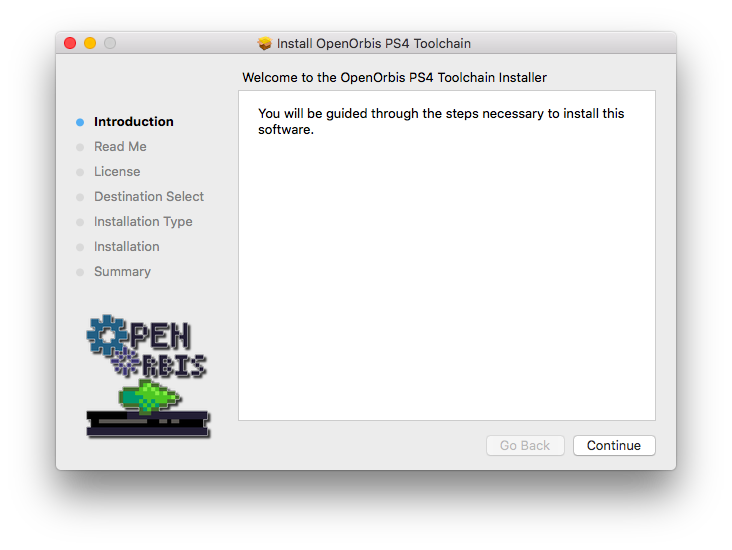

# macOS PKG files

## Summary
This folder contains the files needed to build the PKG installer for macOS. This does **not** build the toolchain itself.

	

### Build
[Packages](http://s.sudre.free.fr/Software/Packages/about.html) is required to build the PKG. Just download it from the link provided and open the file `OpenOrbis PS4 Toolchain.pkgproj`. Click on Build in the menu bar and then click Build again (or you can use ⌘ + B). Then, a window will appear showing the build progress. Once it finishes you can find the PKG installer at `/OpenOrbis-PS4-Toolchain/extra/OpenOrbis PS4 Toolchain.pkg`

If you want to change the installation path of the PKG you will need to edit the `OpenOrbis PS4 Toolchain.pkgproj` file manually (It's a simple XML file, so you would not have any trouble at all editing it with your prefered text editor).
