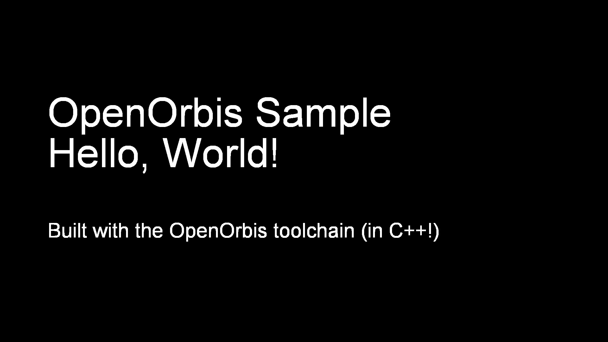

# Sample: font

[](https://github.com/Cryptogenic/OpenOrbis-PS4-Toolchain)

This project contains example code for initializing the SceVideoOut library, and for CPU rendering text on the screen with an arial font. A screenshot from the running application can be seen below.




## Directory structure
```
samples/font
|-- font    
    |-- x64
        |-- Debug               // Object files / intermediate directory
    |-- build.bat               // Batch file for building on Windows
    |-- font.vcxproj            // Visual studio project files
    |-- font.vcxproj.filters
    |-- font.cvxproj.user
    |-- graphics.cpp            // Source code related to graphics / interfacing with SceVideoOut
    |-- graphics.h              // Header file for graphics helper functions
    |-- main.cpp                // main source file
|-- aria.ttf                    // arial font file (should be in pkg root)
|-- eboot.bin                   // final eboot (not present until built)
|-- font.sln                    // Visual studio solution file
|-- Makefile                    // Make rules for building on Linux
```
The ELF, Orbis ELF (OELF), and object files will all be stored in the intermediate directory `x64/Debug`. The final eboot.bin file will be found in the root directory.


## Libraries used

- libc
- libkernel
- libSceVideoOut
- libSceSysmodule
- libSceFreeType


## Building

A visual studio project has been included for building on Windows. On Linux, a makefile has been included.

To build this project, the developer will need clang, which is provided in the toolchain. The `OO_PS4_TOOLCHAIN` environment variable will also need to be set to the root directory of the SDK installation.

__Windows__
Open the Visual Studio project and build, or run the batch file from command prompt or powershell with the following command:
```
.\build.bat .\x64\Debug "hello_world" "%OO_PS4_TOOLCHAIN%\\samples\\hello_world"
```

__Linux__
Run the makefile.
```
make
```


## Author(s)

- Specter
- Crazyvoid "added text wrapping"