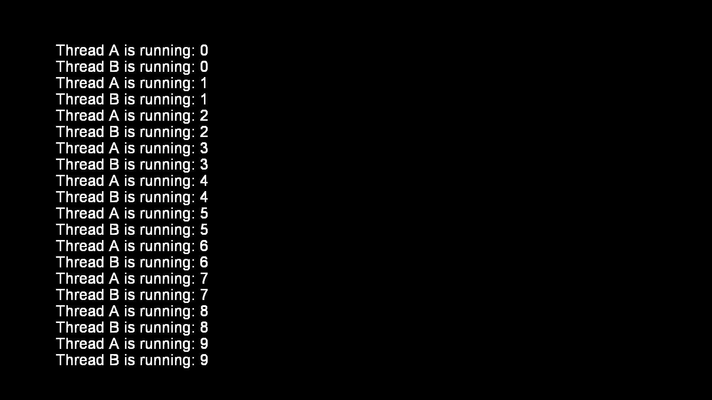

# Sample: threading

[](https://github.com/Cryptogenic/OpenOrbis-PS4-Toolchain)

This project contains example code for running pthreads for concurrent programming. Writes to the screen with 2 threads in a loop.




## Directory structure
```
samples/threading
|-- threading
    |-- x64
        |-- Debug             // Object files / intermediate directory
    |-- build.bat             // Batch file for building on Windows
    |-- main.cpp              // main source file
    |-- threading.vcxproj     // Visual studio project files
    |-- threading.vcxproj.filters
    |-- threading.cvxproj.user
|-- eboot.bin                 // final eboot (not present until built)
|-- threading.sln             // Visual studio solution file
|-- Makefile                  // Make rules for building on Linux
```
The ELF, Orbis ELF (OELF), and object files will all be stored in the intermediate directory `x64/Debug`. The final eboot.bin file will be found in the root directory.


## Libraries used

- libc
- libkernel
- libc++
- libSceVideoOut
- libSceSysmodule
- libSceFreeType


## Building

A visual studio project has been included for building on Windows. On Linux, a makefile has been included.

To build this project, the developer will need clang, which is provided in the toolchain. The `OO_PS4_TOOLCHAIN` environment variable will also need to be set to the root directory of the SDK installation.

__Windows__
Open the Visual Studio project and build, or run the batch file from command prompt or powershell with the following command:
```
.\build.bat .\x64\Debug "networking" "%OO_PS4_TOOLCHAIN%\\samples\\networking"
```

__Linux__
Run the makefile.
```
make
```


## Author(s)

- Specter
- CrazyVoid
